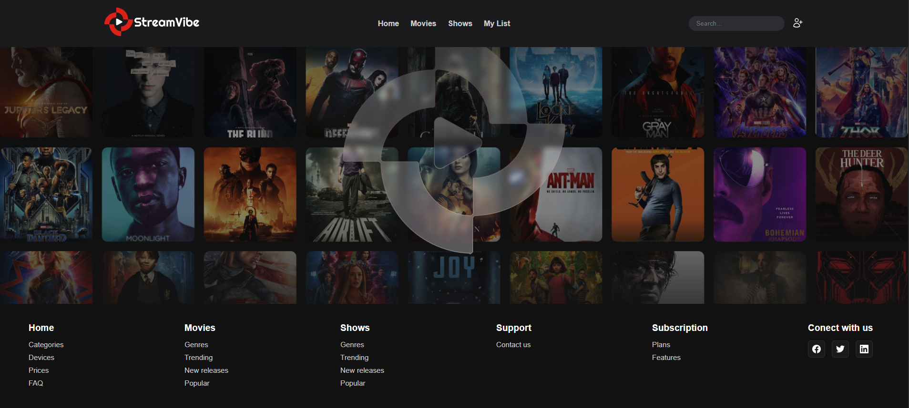

<div align="center">

  # StreamVibe - A plataforma que revoluciona como você avalia filmes e séries

</div>

## Descrição
**StreamVibe** é um sistema simples voltado para o mundo cinéfilo e desenvolvido com **Python** e **Django**, permitindo que os usuários possam adicionar filmes e séries ao catálogo e avaliar de acordo com as suas experiências. O objetivo do projeto é proporcionar uma maneira intuitiva e rápida de organizar filmes, séries e usuários para futuras interações e propor recompensas exclusivas.

<p align ="center">

</p>

## Funcionalidades

- **Cadastro e Avaliação**: Adicione filmes e séries com título, gênero, ano de lançamento e sinopse e avalie cada um deles.
- **Busca e Filtro**: Encontre filmes e séries por título, gênero ou ano de lançamento.
- **Interação com o Catálogo**: Interaja com o catálogo, podendo marcar favoritos ou fazer recomendações (em desenvolvimento).
- **Recompensa por Interação**: Receba criptomoedas exclusivas ao avaliar filmes e séries, podendo trocar por cursos de tecnologia (em desenvolvimento).

## Tecnologias Utilizadas

- **Python**
- **Django**
- **SQLite**
  
## Como Rodar o Projeto Localmente

1. Clone o repositório:
    ```bash
    git clone https://github.com/danielvigon/stream-vibe.git
    ```

2. Acesse o diretório do projeto:
    ```bash
    cd stream-vibe
    ```

3. Crie e ative um ambiente virtual (recomendado):
    ```bash
    python -m venv venv
    source venv/bin/activate  # No Windows, use `venv\Scripts\activate`
    ```

4. Instale as dependências:
    ```bash
    pip install -r requirements.txt  # Se estiver disponível
    ```

5. Execute as migrações do banco de dados:
    ```bash
    python manage.py migrate
    ```

6. Inicie o servidor de desenvolvimento:
    ```bash
    python manage.py runserver
    ```

7. Acesse o projeto no navegador:
    ```
    http://127.0.0.1:8000/
    ```

## Como Contribuir

1. Faça um **fork** deste repositório.
2. Crie uma **branch** para a sua feature (ex: `feature/nova-funcionalidade`).
3. Realize as alterações necessárias.
4. Envie um **pull request** com uma descrição detalhada da alteração.

## Licença

Este projeto está licenciado sob a **MIT License** - consulte o arquivo [LICENSE](./LICENSE) para mais informações.

## Demonstração

Se você já tiver o projeto rodando, pode adicionar algumas imagens ou uma pequena demonstração de como o sistema se comporta:

- Página de cadastro de filmes
- Tela de login de usuários

## Roadmap

- [ ] Implementar funcionalidades de comentários.
- [ ] Criar um algoritmo de recomendações baseado nos filmes assistidos.
- [ ] Adicionar suporte para múltiplos tipos de usuários (ex: administradores e usuários comuns).
- [ ] Implementar integração com APIs externas de filmes (como IMDb ou The Movie Database).


